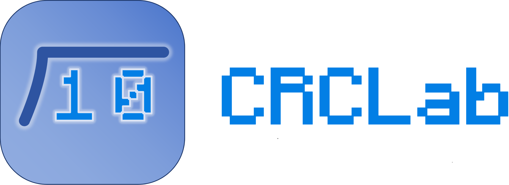

# CRCLab (CRC 循环冗余校验计算与可视化工具)

<div align="center">
  
</div>

## 1. 软件概述
`CRCLab` 是一款基于 Python 与 Tkinter 开发的 CRC 长除法计算与可视化工具。支持常用标准多项式（CRC-4/8/16/32）及自定义多项式的模二除法演算，并以图形化展示计算过程。

- **多格式导出**：支持图表导出为 PNG、JPG、SVG、PDF 及 EMF 矢量图
- **独立运行**：支持通过 Nuitka 编译为无依赖的 Windows `.exe`

## 2. 运行环境与依赖
- **操作系统**：Windows 10/11 (x64)
- **环境要求**：Python 3.10+
- **核心依赖**：`Pillow`、`svglib`、`reportlab`（运行期），`nuitka`、`zstandard`（打包期）

## 3. 安装与本地运行
建议在 Python 虚拟环境中运行：

```powershell
# 1. 创建并激活虚拟环境
python -m venv .venv
.\.venv\Scripts\Activate.ps1

# 2. 安装依赖
pip install nuitka zstandard Pillow svglib reportlab

# 3. 运行程序
python main.py
```
*注：若遇环境变量冲突，建议直接使用解释器路径执行（如 `.\.venv\Scripts\python.exe main.py`）。*

## 4. 可执行程序打包
项目内置 `build_exe.py` 脚本，用于将程序打包为独立可执行文件。

**环境准备**：需安装 [Visual Studio 2022 社区版](https://visualstudio.microsoft.com/zh-hans/downloads/)（安装时勾选“使用 C++ 的桌面开发”）。

**执行打包**：
```powershell
python build_exe.py
```
编译通常耗时 2-5 分钟，完成后会在 `dist` 目录下生成 `CRCLab.exe`。

> **注意**：进行生产环境发布打包时，**请务必在独立的虚拟环境 (venv) 中进行**。这可以确保仅打包必需的依赖项，避免引入系统全局的多余依赖导致可执行文件体积臃肿。

## 5. 常见问题排查
- **PDF 导出报错**：确认虚拟环境中已正确安装 `svglib` 和 `reportlab`。
- **找不到模块 (ModuleNotFoundError)**：通常由于虚拟环境激活失效，导致包被安装到了全局。建议直接使用 `.\.venv\Scripts\python.exe -m pip install ...` 重新安装。

## 6. 技术致谢
本项目在开发、重构及问题排查过程中，使用了 Google Gemini AI 与 OpenAI Codex 进行辅助编码。
